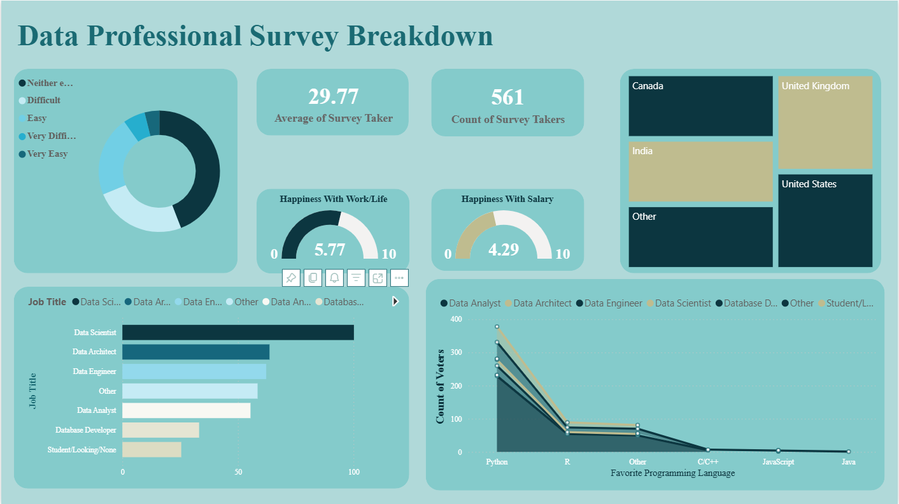

# Power BI Survey Analysis Project

This project analyzes survey data using Power BI to uncover insights about salaries, job roles, and demographics.

The dashboard provides interactive visualizations that help explore trends and patterns in the dataset.

## Tools Used
- Power BI  
- Power Query  

## Dataset
- Survey Breakdown.xlsx

## Features
- Salary distribution by job role  
- Demographic analysis  
- Interactive filters and slicers  

## Dashboard Preview

## Files
- Survey BreakDown.pbix  
- Survey Breakdown.xlsx  

## Author
TAYSON
